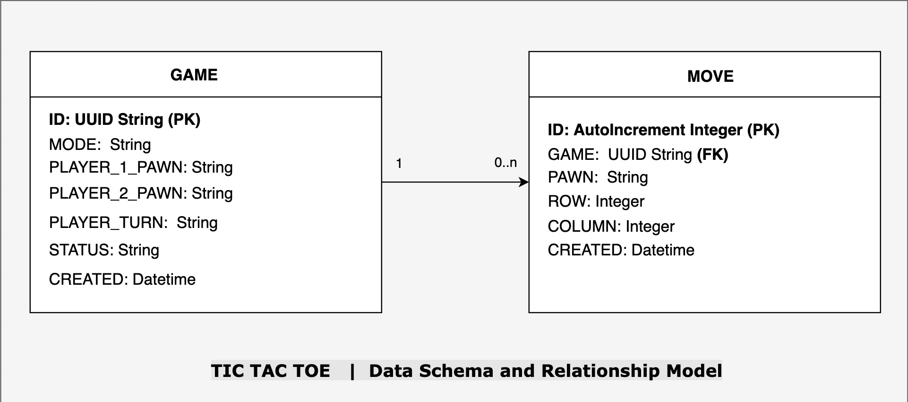

# Development and Design documentation

These are some technical documentation pertaining to design and development of the backend application.

- [Configuration](#configuration)
- [Testing](#testing)
- [Extensibility](#extensibility)
- [Data Schema](#data-schema)
- [Data Models](#data-models)
- [Enhancement Possibilities](#enhancement-possibilities)
- [Future scope](#future-scope)

## Configuration

Caching feature has been introduced as configurable feature, that can be toggled on/off during setup.
- By default it is set to `False` 
- To change: `docker-compose.yml > services > web > environment > CACHE_ENABLED`
> _It has been found to be useful in best case scenarios, but looses it's benefit with increased load. Hence, it is disabled by default, but based on use-case can be enabled for some performance gains._

## Testing

- Unit tests are written for service and helper methods. To run the tests in the running container, first get the container id corresponding to web module, then execute the pytest command against it in second command. 
```sh 
docker ps
```
```sh
docker exec container_id python -m pytest ./tests
```
- Postman collections are provided for end to end integration scenarios (positive and negative) as well.


## Extensibility

The following was taken into consideration while developement:

- It is possible that later on we add some variation of the game, so we need to define a common ground for it. The abstract class `AbstractMNKGame` and dataclass `MNKGameData` was used with that purpose, to define the most basic interface that would be needed along with basic fields that would be required for all.
- We can add these in their own svc classes, and then redirect to appropriate service at runtime on the basis of request configuration parameters.
- At the moment players are using only `x` and `o` as their pawns, but it is possible that they we can offer flexibility in near future to choose different markers. So, this was considered during implementation of logic and already accomodates different markers. The client can still send default markers.
- At the moment the starting pawn is fixed to `x`, but we may want to provide a different pawn based on different configuration, or as per user input. This was considered and accomodated during implementation with help of an optional override parameter.

## Data Schema

The following schema was chosen for persisting game data (with the assumed scope):




## Data Models

We are making use of 3 types of models in our project, each for a different layer.

1. Pydantic Models [router layer]
   - This is used for our API request data (`CreateGameRequest`, `MakeMoveRequest`)
   - Its main benefits:
     - parses request body into python object directly
     - provides validation for request payload based on model, implicitly (so we don't need to add more code to make sure mandatory fields are present, or data type constraints are met, etc.) 

2. Python Dataclass [service layer]
   - This is used for our internal service logic, and represents the entire game state. It is needed to be able to validate moves and check the validity of game state in whole. (`Move`, `TicTacToeData`, `MNKGameData`)

3. Ormar Models [db layer]
   - These models are to map data between our service layer and database. This helps us to move data to and fro with the DB. (`Games`, `Moves`)
   - It is also used to spawn the tables and acts as the table schema.


## Enhancement Possibilities

Some things that we could do to improve our existing project further:

- Investigate cache gains and see if something can be done to make it even better.
- Setting up pipeline to automate running of tests.
- Investigate if there is a need to swap out `ormar` with another python `ORM` (Object-relational Mapper Software).
- Investigate from business/functionality end do we also need more atomic APIs like:
  - getGameByGameId           : `GET` `/tictactoe/{game_id}`
    > In case we want to resume game after a connection drop
  - getStatusByGameId         : `GET` `/tictactoe/{game_id}/status`
    > In case we want to know a given game's status only
  - getMovesByGameId          : `GET` `/tictactoe/{game_id}/moves`
    > In case we want to know a given game's move history only
  - getBoardByGameId          : `GET` `/tictactoe/{game_id}/board`
    > In case we need a given game's game board only
  - getPlayerTurnByGameId     : `GET` `/tictactoe/{game_id}/playerturn`
    > In case we want to know a given game's player turn only
- Investigate if any edge cases were missed


## Future scope

We can consider the following changes to our project:

- Adding user/player module
  - This would mean having a player login on client, storing the player info (like name, email, credentials, etc).
  - This would allow saving games by playerId, and continuing games from where they were left off.
  - This would also allow players to play over the network and play with their friends.
    - They can either discover open games and request to join them OR they can create one and ask their friend to join/invite them. (We would have to maintain game room concept).
    - This would however need more robust system, with messaging/notification capabilities.
  - We can then also think of enhancing APIs for searching and filtering games by different criteria:
    - getAllGames               : `GET` `/tictactoe/`
      > To get all games in DB

    - getGamesByStatus          : `GET` `/tictactoe/?status=xyz`
      > To get all games in DB of a give status

    - getGamesByDate            : `GET` `/tictactoe/?created=xyz`
      > To get all games in DB of given date

    - getGamesByPlayerId        : `GET` `/tictactoe/?player=xyz`
      > To get all games in DB where a given player was part of

    - getGamesByPlayerIds       : `GET` `/tictactoe/?player1=xyz&player2=abc`
      > To get all games in DB with a given set of players
- We already have move history, we can add support on top of this to provide `undo move` functionality.
- We can create a game dashboard for analytics on different game KPIs like player engagement, most popular game modes, most popular configuration, etc. 
- We can test deployment and scaling options, based on performance metrics after investigating and collecting the required information.